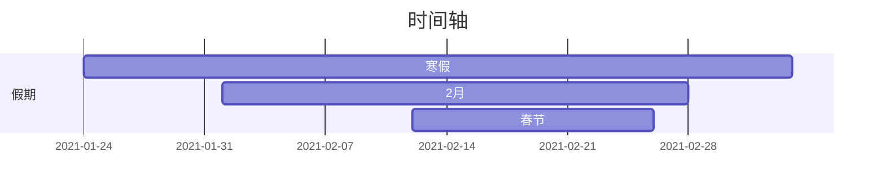
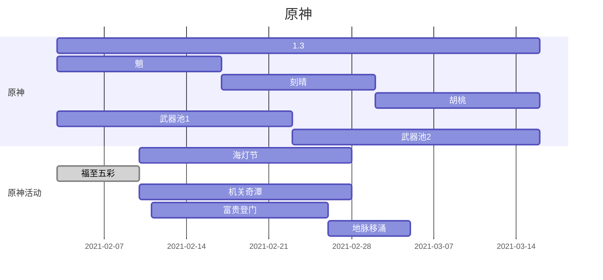

```mermaid
gantt
dateformat YYYY-MM-DD
title 时间轴
section 假期
寒假:2021-01-24,2021-03-06
2月:2021-02-01,2021-02-28
春节:2021-02-12,2021-02-26
```

```mermaid
gantt
title 原神
dateformat YYYY-MM-DD
section 原神
1.3:1.3,2021-02-03,2021-03-16
魈:2021-02-03,2021-02-17
刻晴:2021-02-17,2021-03-02
胡桃:2021-03-02,2021-03-16
武器池1:2021-02-03,2021-02-23
武器池2:2021-02-23,2021-03-16
section 原神活动
海灯节:2021-02-10,2021-02-28
福至五彩:done,2021-02-03,2021-02-10
机关奇潭:2021-02-10,2021-02-28
富贵登门:2021-02-11,2021-02-26
地脉移涌:2021-02-26,2021-03-05
```

